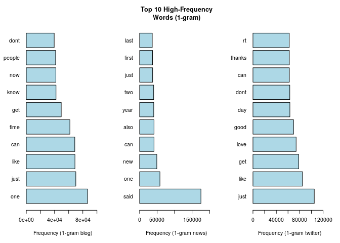
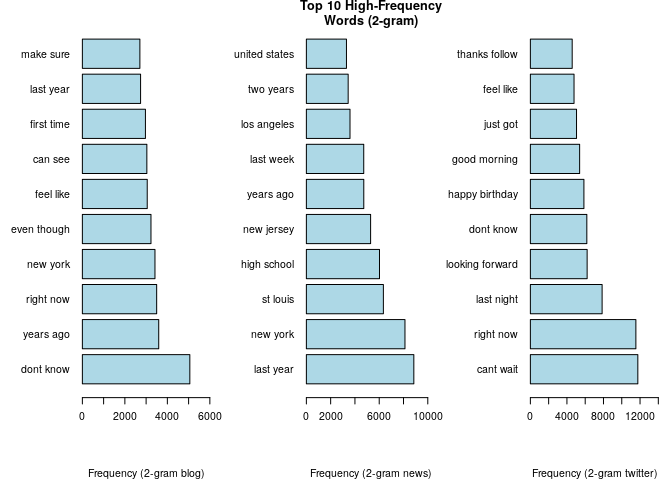
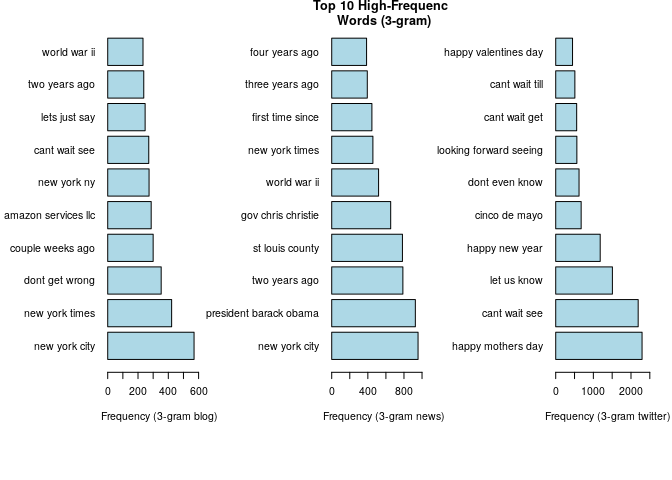
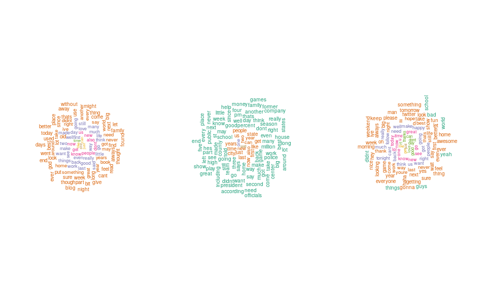

## 1. Synopsis

The goal of the project is to develop the predicting algorithm and Shiny App for natural language processing (text mining and processing). We used the provided Swiftkey dataset and prepared the progress report based on initial findings. The text file containing the texts from blogs, news and twitter in English version are briefly examined. The works covered by this report can be summarized in the following points:

- The data has been filtered by removing the characters and words that do not contribute much and are supposed to be stopwords in English.
- The total words in the combined datasets (blogs, news and twitter) is more than 100 million. Each data source i.e. blog, news and twitter contains variety of unique words that appears at different frequency.
- The most frequently used 100 words have been shown in word clouds for each data source.
- The outline for the development of word predicting algorithm and Shiny App has been presented.

The R-markdown file and codes made for the data analysis is placed [GitHub](https://github.com/akhadka525/Data-Science-Capstone). Please refer the [GitHub](https://github.com/akhadka525/Data-Science-Capstone) section for R-codes used for data analysis and visualization.

## 2. The Data

The data used in the study is sourced from [Data Science Capstone Dataset](https://d396qusza40orc.cloudfront.net/dsscapstone/dataset/Coursera-SwiftKey.zip) as a part of Data Science Specialization Course in Coursera. The dataset consists of text file from blogs, news and twitter. These text data are in different languages such as German, English, Russian and Finnish. For this project we will consider only the English version.

### 2.1 Summary of Data

The following text files are used for the study.

| Name                | Name in Report| Description                                      |
|---------------------|---------------|------------------------------------------------  |
| en_US.blogs.txt     | blog          | A text file of blog-related text in US English.  |
| en_US.news.txt      | news          | A text file of news-related text in US English.  |
| en_US.twitter.txt   | twitter       | A text file of tweets from Twitter in English.   |

Some of the text samples from the each text file includes:

a) Sample text from blogs:
In the years thereafter, most of the Oil fields and platforms were named after pagan “gods”., We love you Mr. Brown.

b) Sample text from news:
He wasn't home alone, apparently., The St. Louis plant had to close. It would die of old age. Workers had been making cars there since the onset of mass automotive production in the 1920s.

c) Sample text from twitter:
How are you? Btw thanks for the RT. You gonna be in DC anytime soon? Love to see you. Been way, way too long., When you meet someone special... you'll know. Your heart will beat more rapidly and you'll smile for no reason.

The text files contain large number of data. The table below illustrates the file size, total number of lines, total character and total words in each text file. Each file contains more than three million words.

| Data Source | File Size (mb)   | Total rows      | Total Characters| Total Words      |
|:-----------:|:----------------:|:---------------:|:---------------:|:----------------:|
| blog        | 255.4 Mb    | 899288   | 206824505   | 37546250   |
| news        | 257.3 Mb    | 1010242   | 203223159   | 34762395   |
| twitter     | 319 Mb | 2360148| 162096241| 30093413|

### 2.2 Data cleaning and Preprossing

The preprocessing and cleaning of the data is important for word prediction algorithm development. However the task is challenging too because of the large size of the text file and the text contains characters including numbers, punctuations, symbols, repeated alphabets in words. So, we preprocess and cleaned the data by;

- converting all words to lowercase
- removing all types of punctuations except apostrophe
- removing numbers
- removing web urls
- removing repeated alphabets in words
- removing multiple spaces
- removing common english words
- removing single alphabets

### 2.3 Sample Data

Since the data size is very large, for some initial data analysis purpose we divide the dataset in the ratio of 70% : 30%. Here we will examine the data features for the 70% of the data with remaining 30% being left for the predictive model testing.

The table below summarizes the total number of words and number of unique words present in the sample data for each text files.

| Data Source | Total rows             | Total Characters       | Total Words             | Total Unique Words             |
|:-----------:|:----------------------:|:----------------------:|:-----------------------:|:------------------------------:|
| blog        | 629502   | 104551756   | 13418344   | 71546   |
| news        | 707170   | 107598388   | 13666997   | 25617   |
| twitter     | 1652104| 83525467| 11993087| 573|

## 3. Preliminary Findings

The sample data has been used to understand the important features of the data. We developed the n-gram model from the corpus and then identify the most frequent words in n-gram, such as 1-gram, 2-gram and 3-gram. The histogram below shows the most frequent 1-gram words for each sample files.

The following histogram shows the most frequent 2-gram words for each sample text files.

The following histogram shows the most frequent 3-gram words for each sample text files.

We also create the top 100 frequently used words for blog, news and twitter sample text data files which are shown in the following word clouds respecively.

## 4. Plan for Predictive Modeling and Shiny App

We examine the text dataset and exploratory analysis of the dataset provides some interesting findings. Next step is to develop the predictive model and Shiny App. We will use the sampled 70% of the data to build the word predictive model and the remaining 30% will be used for the model evaluation. The following are the plans for the predictive model and Shiny App development.

- First the model will be developed, trained and cross validated using the 70% of the data used to prepare this report.
- Development of initial predictive model based on the 1-, 2-, and 3-gram most frequently used words from sentences.
- The report shows there are some words such as rt, llc and others. These words will be removed.
- If necessary word clustering will also be done.
- The words will be weighted based on frequency and only those words will be used for the model and app development.

## References

1. Data Source: 
<https://d396qusza40orc.cloudfront.net/dsscapstone/dataset/Coursera-SwiftKey.zip>

2. Feinerer, I., Hornik, K., & Meyer, D. (2008). Text Mining Infrastructure in R. Journal of Statistical Software, 25(5), 1–54. https://doi.org/10.18637/jss.v025.i05 <https://www.jstatsoft.org/article/view/v025i05>
